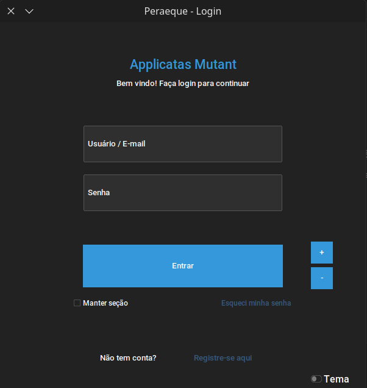
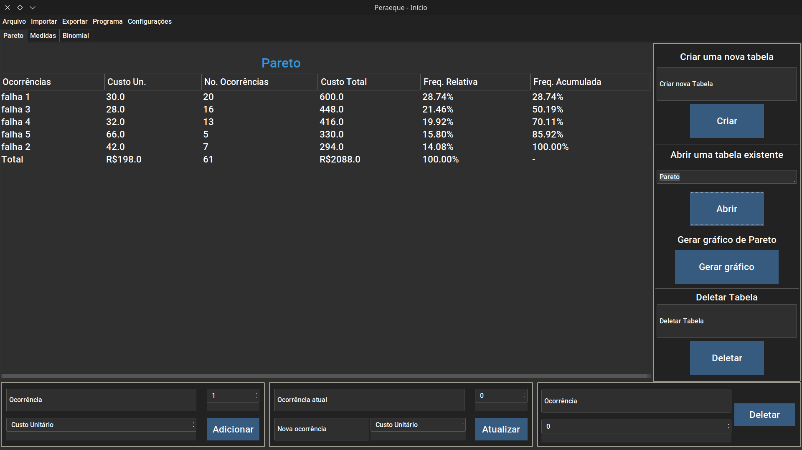
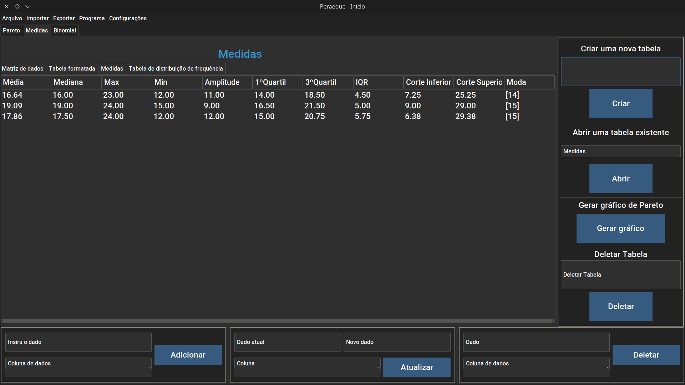
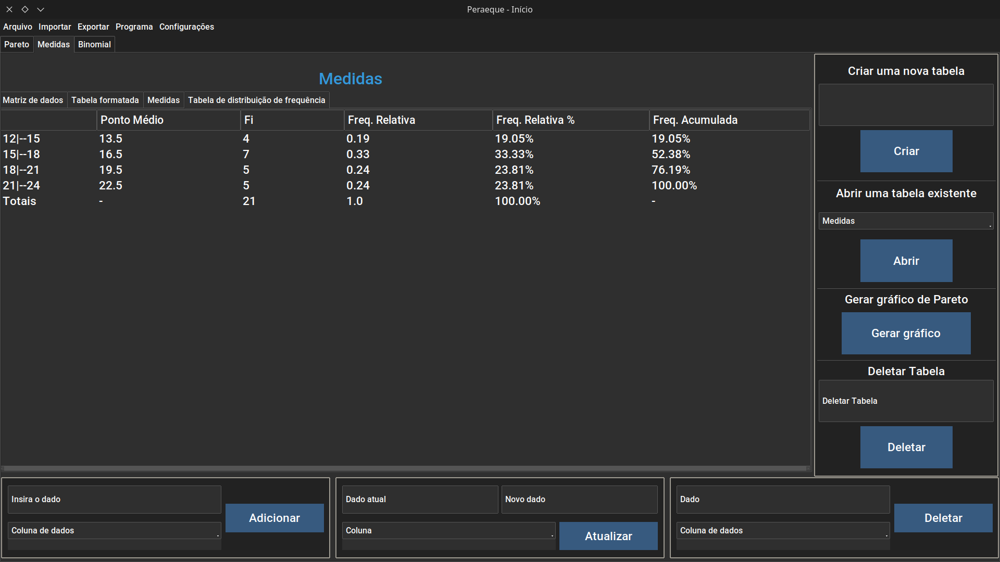
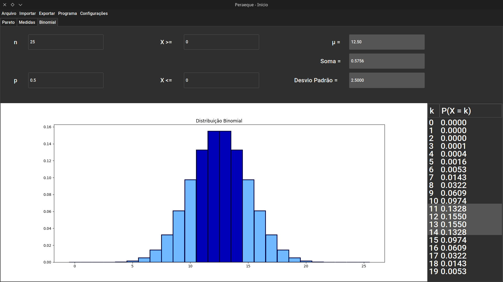
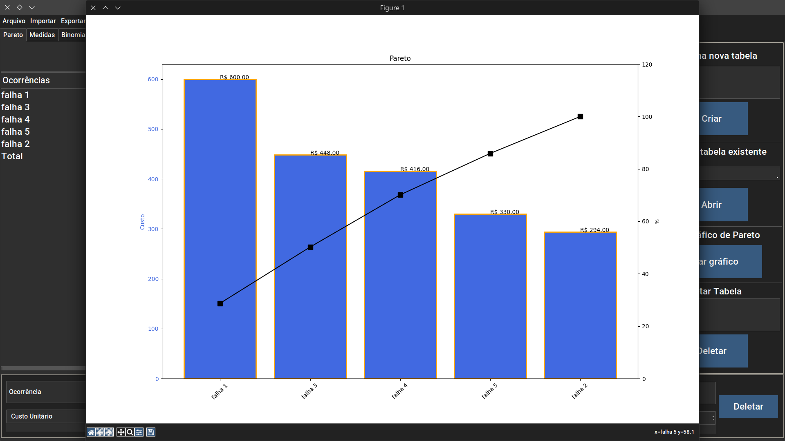
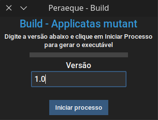
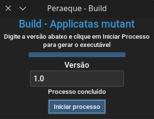

# APPLICATAS MUTANT

Projeto de estatística. Feito para inserir, atualizar e deletar dados para a criação de tabelas de **Análise de Pareto, Medidas de Tendência Central e Distribuição de Frequência** utilizando SQLite, CSV, tabelas do Excel e arquivos SQL.

Permite a criação de **gráficos de pareto, histogramas, boxplot e distribuição binomial** de forma simples e dinâmica para perfeita análise dos dados obtidos.

## Screenshots

  
   

  
   

  
   

## Principais Bibliotecas utilizadas e instalação
- tkinter
- ttkbootstrap
- pandas
- numpy
- matplotlib
- sqlite3
- scipy

Os executáveis desse programa podem ser encontrados na aba [releases](https://github.com/snootic/applicatas-mutant/releases). Disponível para Windows e Linux

Para Rodar o código, clone este repositório `https://github.com/Snootic/applicatas-mutant.git` e instale as dependências que estão no arquivo requirements.txt

**Altamente recomendado a utilização de um virtual env**

### Windows
Powershell / Terminal: 

        py -m pip install -r requirements.txt

        python -m pip install -r requirements.txt

### Linux

        pip3 install -r requirements.txt
        pip install -r requirements.txt

Em algumas distribuições com mecanismo de proteção aos pacotes do sistema (ex: OpenSUSE Tumbleweed), o comando acima pode dar erro. Para resolver adicione o parâmetro `--break-system-packages`.

## Build
O projeto foi empacotado utilizando **PyInstaller**.
Para fazer sua própria Build, siga os seguintes passos
(**Altamente recomendado a utilização de um virtual env**):

- Abra `Build.py`

- Insira a versão do programa (obrigatório)

- Clique em `Gerar executável`

Em poucos minutos o executável estará completo na pasta `dist` com todos os assets em seus repectivos diretórios.

## Bug report e sugestões

Para, bugs, falhas e sugestões, abra um `Issue` ou `pull request`, que veremos e resolveremos o problema o mais rápido possível.