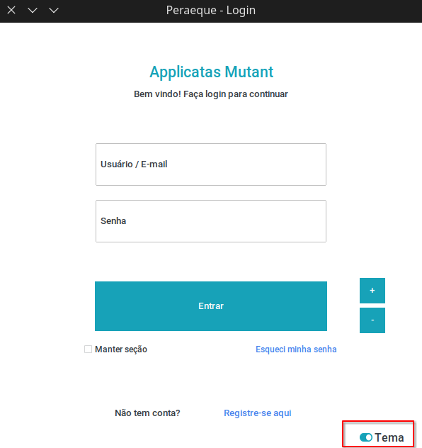

# Peraeque - Como usar

## 1 - Primeiro Acesso
Para utilizar o programa o usuário irá precisar de uma conta local, o motivo para tal está no fato de que os arquivos e tabelas criadas e gerenciadas são intrinsecamente ligados a cada usuário, permitindo um uso único para cada um.

### 1.1 - Registro
Para criar uma conta clique em **Registrar** na tela de login (primeira tela ao abrir o programa).

#### 1.1.1 - Usuário
O nome de usuário deve ser único e deve ter no **mínimo** 3 caracteres e no **máximo** 16. O uso de letras maiúsculas e minúsculas é irrelevante.

#### 1.1.2 - Email
Cada usuário deve ter um email válido **e** único atrelado a sua conta.

### 1.1.3 - Senha
A senha do usuário deve ter no **mínimo** 8 caracteres e no **máximo** 16.

Os caracteres especiais permitidos para a criação de senha no programa são somente: **!#$%&**.

O usuário pode utilizar os botões **ver senha** (símbolo de olho) e **gerar senha** (símbolo de reset) para ver/esconder e gerar uma senha forte e aleatória de 12 caracteres, respectivamente.

No campo de **repetir senha**, deve ser inserida a mesma senha do campo senha, para que seja confirmada a utilização desta senha.

Após a confirmação da senha, basta apenas clicar no botão confirmar logo abaixo e a conta será criada com sucesso, se todos os requisitos foram cumpridos.

  
   

### 1.2 - Login

Após o registro, basta apenas logar-se.

#### 1.2.1 - campos de login
Aqui se insere o usuário ou o e-mail e a senha cadastrados anteriormente.

#### 1.2.2 - Manter seção
O botão de manter seção, como o nome sugere, mantém a conta logada no programa mesmo que o mesmo seja fechado, fazendo com que na próxima vez que ser aberto, o pule automaticamente o processo de login.

## 2 - Estrutura básica do programa

### 2.1 - Menu Principal
O menu do programa é base para diversas funções essenciais, ele pode ser acessado na tela inicial, após o usuário ter logado, na barra superior.

#### 2.1.1 - Arquivo
A cascada **"Arquivo"** no menu do programa traz diversas funções que o usuário pode utilizar para manipular suas tabelas internas, tais como:

- **Salvar Backup**: Salva a seguinte tabela em um arquivo SQL, para que possa aplica-la em outro banco de dados ou restaura-la para o ponto especificado no futuro.

- **Restaurar Backup**:Restaura o arquivo SQL salvo anteriormente, seja por qual for o motivo. 
***Nota: Restaurar uma tabela a um ponto no passado irá substituir as alterações mais recentes, resultando na perda desses dados.***

- **Salvar arquivo**: Sava as alterações recentes nas tabelas modificadas, fazendo-as permanentes.

- **Desfazer alterações**: Defaz as alterações mais recentes nas tabelas modificadas, podendo reverter uma adição feita por engano.

- **Refazer alterações**: Refaz as alterações desfeitas recentemente caso seja necessário.

- **Sair**: Desloga a conta do usuário e retorna a página de login.

- **Fechar**: Fecha o programa.

### 2.2 - Menu de tabelas
As abas **Pareto** e **Medidas** compartilham de um menu chamado **menu de tabelas**, onde se tem funções comuns utilizadas para a manipulação das tabelas no programa.

#### 2.2.1 - Criar tabela
O nome da tabela deve ser inserido, em seguida o botão **Criar** deve ser pressionado, a tabela criada será aberta automaticamente. Caso seja inserido o nome de uma tabela já existente, a mesma será aberta.

#### 2.2.2 - Abrir tabela Existente
Abre um menu com todas as tabelas criadas pelo usuário, onde é possível escolher uma. Após apertar o botão **Abrir**, a tabela será aberta automaticamente. Os dados da tabela aberta anteriormente não serão perdidos.

#### 2.2.3 - Gerar Gráfico
Um botão que, se pressionado, abrirá o gráfico referente a aba presente. Para aba **Pareto**, será aberto um gráfico de pareto. Para a aba **Medidas** um popup será aberto com duas opções de gráfico: Histograma e Boxplot.

#### 2.2.4 - Deletar Tabela
O nome da tabela deve ser inserido, em seguida o botão **Deletar** deve ser pressionado, um popup perguntando se a alteração deve ser mesmo realizada será aberto. Caso a tabela exista, a mesma será deletada.

## 3 - Análise de pareto
Para trabalhar com a análise de pareto, pode-se utilizar dados qualitativos e/ou quantitativos. Isso irá implicar em mudanças sutis nos cálculos da tabela e da formulação do gráfico.

### 3.1 - Estrutura dos dados
#### 3.1.1 - Dados quantitativos
Para a estrutura para dados quantitativos é preciso informar qual ocorrência deseja adicionar e sua quantidade.

Caso deseje importar um arquivo CSV ou Excel, a estrutura necessária para a adição dos dados será de apenas uma coluna onde a ocorrência desejada será repetida quantas vezes for necessário, para que somando de o resultado final.

#### 3.1.2 - Dados qualitativos

A estrutura para dados qualitativos a princípio se assemelha a de dados quantitativos, seu diferencial está no fato de que o usuário pode adicionar um custo para a ocorrência indicada. A soma final será dos custos unitários * quantidade de ocorrências.

Para importar um arquivo CSV ou Excel, a estrutura base é a mesma dos dados quantitativos, com o adicional de uma coluna para especificar o custo unitário de cada ocorrência.

Caso queira importar uma tabela completa, a base segue a mesma, porém o usuário deve se atentar as seguintes restrições:

- A tabela deve conter exatamente 6 colunas.
- A primeira coluna deve conter as Ocorrências.
- A quarta coluna deve conter a soma dos custos unitários.
- A quinta e a sexta devem ser A frequência relativa (%) e a frequência acumulada, respectivamente.

### 3.2 - Alterar dados
O processo para alterar dados é semelhante ao de adicionar. Primeiro deve-se informar a ocorrência que deve ser alterada no campo **Ocorrência Atual**, em seguida a quantidade que deve ser alterada (caso não seja indicada ou seja igual a 0, todos os itens da ocorrência indicada serão alterados), por último, basta indicar o nome da nova ocorrência no campo **Nova Ocorrência** e pressionar o botão **Alterar**.

Para tabelas qualitativas, o **custo unitário** será automaticamente indicado baseado na ocorrência atual. Para alterar basta apenas modificar seu valor.

### 3.3 - Deletar dados
Para deletar uma ocorrência, basta apenas indicar seu nome no campo **Ocorrência**, no quadro inferior direito contendo o botão **Deletar**, a quantidade indicada decidirá quantos itens dessa ocorrência serão deletados. Deixar a quantidade em 0 resultará em todos os itens sendo deletados.

### 3.4 - Gráfico
Caso todos os dados estejam estruturados de acordo com os passos anteriores, pode-se gerar um gráfico de pareto, bastando apenas clicar no botão **Gerar Gráfico**, no *menu de tabelas*.

## 4 - Medidas de Tendência Central
A aba de **Medidas** possui 4 tabelas onde os dados podem ser acessados: **Matriz (Rol) de dados, Tabela Formatada, Medidas e Tabela de Distribuição de Frequência (TDF)**.
### 4.1 Estrutura dos dados
#### 4.1.1 - Adicionar dados
A estrutura de medidas é simples, basta apenas inserir qual o **dado** a ser adicionado, sendo ele um número inteiro ou fracionado, e qual a **coluna** que este dado estará presente (caso não específicada a coluna será a primeira [Coluna 1]). ***Nota: As colunas devem possuir a mesma quantidade de dados.***

#### 4.1.2 - Importar dados

Para o importar dados, a lógica segue a mesma, um arquivo **CSV** ou **XLSX** com uma ou mais colunas contendo os dados que devem ser importados. ***Nota: As colunas devem possuir a mesma quantidade de dados.***

### 4.2 - Alterar dados
O processo para alterar dados é semelhante ao de adicionar. Primeiro deve-se informar o dado que deve ser alterada no campo **Dado Atual**, em seguida informar o novo dado a ser adicionado no campo **Novo Dado** e qual a **coluna** em que este dado está localizado.

### 4.3 - Deletar dados
Para deletar um dado, basta apenas indicar seu nome no campo **Dado**, no quadro inferior direito contendo o botão **Deletar**, e selecionar sua **Coluna**.

### 4.4 - Gráfico
Caso todos os dados estejam estruturados de acordo com os passos anteriores, pode-se gerar um **Histograma** ou **BoxPlot** , bastando apenas clicar no botão **Gerar Gráfico**, no *menu de tabelas*. Ao clicar no botão um popup será aberto perguntando qual gráfico deve ser gerado.

#### 4.4.1 - Histograma
Caso seja escolhida a opção Histograma:

#### 4.4.2 - BoxPlot
Caso seja escolhida a opção BoxPlot:

## 5 - Binomial
A aba **Binomial** se constitui numa calculadora de Distribuição de Probabilidade Binomial.

### 5.1 - Cálculo
Para o cálculo binomial deve-se informar os seguintes dados:
- **N**: total de ensaios.
- **P**: probabilidade de sucesso (*entre 0 e 1*).

Após definir esses campos, o gráfico e a tabela com os resultados serão gerados automaticamente.

### 5.2 - Filtro
O filtro do gráfico binomial se trata de quais campos **K** (Número de sucessos da amostra) estará se referindo.

- **X >=**: Define o índice **mínimo** de K.
- **X <==**: Define o índice **máximo** de K.

Alternativamente, pode-se utilizar a tabela a direita contendo os resultados para definir e filtrar K, bastando apenas selecionar o(s) índice(s) desejados.

## 6 - Visual

É possível editar o visual do programa para se adequar aos gostos do usuário.

### 6.1 - Tema

O programa vem por padrão no tema **Darkly**, sendo sua alternativa do modo claro chamada **Litera**. Existem uma variedade de outros temas que podem ser utilizadas, existindo algumas formas de troca de tema.

- tema darkly

- tema litera

#### 6.1.1 - Troca de tema
Existem 3 formas posssíveis de trocar o tema do programa:
#### 6.1.1.1 - Tela de login
O botão inferior direito **Tema** trocará o tema entre as 2 versões principais **Darkly** e **Litera**.

#### 6.1.1.2 - Menu Programa
O menu **Programa**, localizado no *Menu Principal*, possui o comando **Trocar Tema**, que trocará o tema entre as 2 versões principais **Darkly** e **Litera**.

#### 6.1.1.3 - Configurações: Visual
O menu **Configurações**, localizado no *Menu Principal*, abrirá um popup na aba **Visual**, que possui o campo **Tema** com uma lista com todos os temas disponíveis. Ao escolher um tema basta apenas clicar em **Salvar** que o mesmo será aplicado instantâneamente.

### 6.2 - Escala
A escala define o tamanho dos widgets na tela. O programa irá automaticamente definir uma escala baseada na escala padrão do sistema (Caso seja Windows). Por padrão, no Linux, a escala é **1**.

#### 6.1.1 Mudança de escala
Existem 3 formas de definir a escala do programa:

#### 6.1.1.1 - Tela Login
É possível alterar a escala pela tela de login. O botão **+** irá aumentar a escala do programa em **0.25** , enquanto o botão **-** irá diminuí-la em **0.25**.

***Nota:É possível apenas definir uma escala entre ***1*** e ***2***. Requer reinicialização do programa para surtir efeito.***

#### 6.1.1.2 - Menu Programa
O menu **Programa**, localizado no *Menu Principal*, possui a cascada **Escala** com dois comandos: **Aumentar**, que irá aumentar a escala do programa em **0.25**; **Diminuir**, que irá diminur a escala do programa em **0.25**.

***Nota:É possível apenas definir uma escala entre ***1*** e ***2***. Requer reinicialização do programa para surtir efeito.***

#### 6.1.1.3 - Configurações: Visual
O menu **Configurações**, localizado no *Menu Principal*, abrirá um popup na aba **Visual**, que possui o campo **Escala** contendo uma lista com todas as opções possíveis de escala. Basta escolher uma e clicar em Salvar.

***Nota:É possível apenas definir uma escala entre ***1*** e ***2***. Requer reinicialização do programa para surtir efeito.***

## 7 - Configurações de conta
É possível editar os dados da conta do usuário

### 7.1 - Esqueci minha senha
Para resetar a senha, basta ir na tela de Login, e clicar no botão **Esqueci minha senha**. Um popup será aberto semelhante a tela de registro, onde o usuário deve inserir o seu nome de usuário e email correspondentes a conta. 

Caso existam e sejam correspondentes, basta apenas digitar a nova senha, seguindo os padrões estabelecidos em *1.1.3 - Senha* e pressionar o botão **Alterar Senha**.

### 7.2 - Alterar dados da conta
No menu **Configurações**, localizado no *Menu Principal*, selecione a aba **Conta**. Nesta aba é possível alterar o **usuário**, **e-mail** e **senha** da conta, seguindo os padrões estabelecidos em *1.1 - Registro*.

### 7.3 - Deletar conta
No menu **Configurações**, localizado no *Menu Principal*, selecione a aba **Conta**. Nesta aba há um botão chamado **Deletar Conta**, ao pressioná-lo, um popup de confirmação será aberto, confirmando se a exclusão deve ser feita. Ao clicar em **Sim**, o usuário será retornado a tela de login e todos seus dados serão deletados permanentemente.

## 8 - Créditos
- Documentação feita por: [Snootic](https://github.com/Snootic)
- Programa desenvolvido por: [Snootic](https://github.com/Snootic)
- Licensa: [Apache 2.0](../LICENSE)
- Repositório: [Applicatas Mutant](https://github.com/Snootic/Applicatas-Mutant)

Obrigado por utilizar o programa!